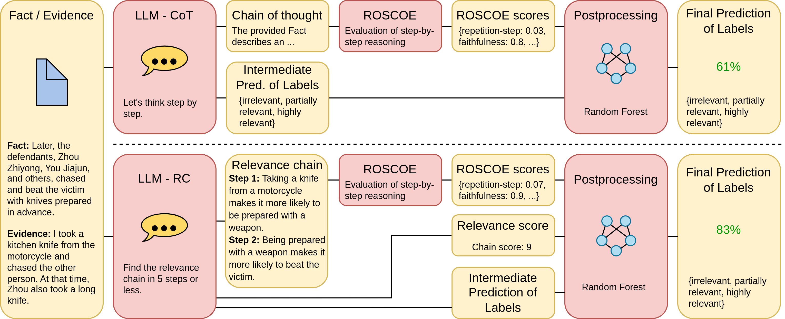

# Relevance chains
The official implementation of the paper "Determining Legal Relevance with LLMs using Relevance Chain Prompting".

## Methodology



## Usage

- Run prompt.py for relevance-chain prompting. This file saves the llm outputs in a .txt file and llm predictions in a .tsv file in separate folders:

```
python prompt.py --model_name gpt-3.5-turbo --prompting_style relevance-chain --shots 2 --steps 5 --dataset val --score_type chain
```

- Run prompt2roscoe.py to convert the relevance chain into into ROSCOE format. This file saves the dictionary for ROSCOE-input in a .json file and chain scores in a .txt file.

```
python prompt2roscoe.py --model_name gpt-3.5-turbo --prompting_style relevance-chain --shots 2 --dataset val
```

- Clone the ROSCOE repo and run ROSCOE metrics on the .json file. Thus, move the .json file to "roscoe/ParlAI/projects/roscoe/roscoe_data/generated" and run:

```
python projects/roscoe/roscoe.py -t sim_sce -m facebook/roscoe-512-roberta-base --datasets ler
```

- Move the created .tsv file with ROSCOE scores in scores_relevance-chain folder. Run correlation.py for postprocessing:

```
python correlation.py --model_name gpt-3.5-turbo --prompting_style relevance-chain --shots 2 --steps 5 --score_type chain
```
